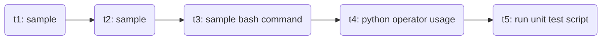

# Airflow/Unit Test Basics

This is a very simple template for basic airflow and unit test. In this repo, the code only shows general airflow process and where unit test can fit into it.  

# Files

* sample_airflow_script.py: This script shows a 5 step airflow process (see chart below), and how unit test script is called in step 5. The template is modified from https://airflow.apache.org/docs/apache-airflow/stable/tutorial.html
* sample_unit_test_script.py: This script can be used as a template to create custom unit tests. It also contains how to interact with database. More info can be found here: https://docs.python.org/3/library/unittest.html
* credentials.yaml: Credentials to database should be put in this file and read in script (here it's used in sample_unit_test_script.py). It's good practice to isolate credentials from functional scripts.

## Usage

This repo only provides templates to show how each component works together. It cannot be ran without replacing made-up code.

## Airflow Steps
